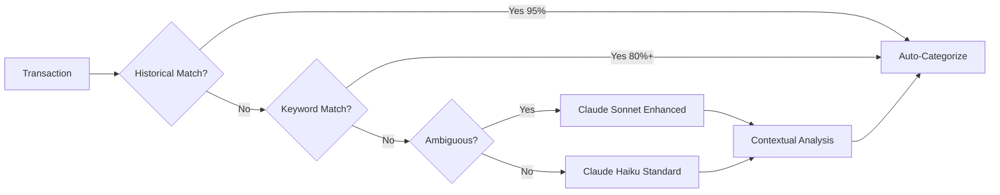

# 💰 Finanzas Email Tracker

<div align="center">

### **Sistema Inteligente de Gestión Financiera Personal con IA**

*Rastrea, categoriza y optimiza tus finanzas automáticamente desde tus correos bancarios*

[](https://www.python.org/downloads/)
[](https://python-poetry.org/)
[](https://opensource.org/licenses/MIT)
[](https://github.com/astral-sh/ruff)
[](https://mypy.readthedocs.io/)
[](tests/)
[](htmlcov/)
[](https://www.anthropic.com/)

[Features](#-features-destacadas) •
[Demo](#-demo) •
[Quick Start](#-quick-start) •
[Architecture](#-arquitectura) •
[Tech Stack](#-tech-stack)

</div>

---

## 🌟 ¿Por qué este proyecto es especial?

Este no es solo otro tracker de finanzas. Es una **aplicación enterprise-grade** que demuestra:

- **🤖 AI/ML Integration**: Claude Sonnet para categorización contextual + ML para predicción de éxito de metas
- **🏗️ Clean Architecture**: Separación en capas, SOLID principles, design patterns (Strategy, Singleton, Facade)
- **🔒 Enterprise Security**: OAuth2 PKCE, validación Pydantic, manejo seguro de credenciales
- **📊 Advanced Analytics**: Detección de patrones comportamentales, insights temporales, análisis predictivo
- **🎨 Modern UI/UX**: Sistema de diseño profesional con animaciones, validación en tiempo real
- **✅ Production-Ready**: Type safety 100%, tests, error handling robusto, soft deletes

---

## ✨ Features Destacadas

### 🎯 **Phase 3: Polish & Wow Factor** (Latest)

#### 🏦 **Financial Goals con ML Prediction**
- Sistema completo de metas de ahorro con milestones
- **Algoritmo ML de 3 factores** para predecir probabilidad de éxito (tiempo vs progreso + tendencia de contribuciones + capacidad de ahorro)
- Recomendaciones personalizadas generadas por Claude AI
- Estados de salud en tiempo real: Excellent, Good, Warning, Critical
- Alertas automáticas cuando una meta está en riesgo

#### 🚀 **Onboarding Wizard con Auto-Detection**
- Wizard de 6 pasos con estado persistente (pausa y continúa)
- **Auto-detección de tarjetas** desde correos históricos (últimos 30 días)
- Pattern matching por keywords para clasificación automática de tipo
- Niveles de confianza (High/Medium/Low) para sugerencias de tarjetas
- Setup completo en menos de 2 minutos

#### 📊 **Reportes Mensuales AI-Powered**
- Reportes narrativos completos generados por Claude Sonnet
- 5 secciones estructuradas: Resumen Ejecutivo, Análisis Detallado, Insights Clave, Recomendaciones, Proyección
- Comparación vs mes anterior con análisis de tendencias
- Exportable a Markdown y JSON

#### 💡 **Enhanced Insights con Análisis Contextual**
- **Patrones de comportamiento**: Fin de semana vs semana, gastos pequeños acumulados
- **Patrones temporales**: Análisis por hora del día, gastos nocturnos (posible impulso)
- **AI Recommendations**: Claude genera insights NO obvios y accionables
- Hasta 10 insights priorizados por impacto

#### 🔍 **Smart Categorization con Contexto**
- **Categorización contextual mejorada**: Considera hora, día, monto, ubicación
- Escalación automática a Sonnet para casos ambiguos (Walmart, Uber, Amazon)
- Ejemplos: "Uber 11pm viernes" → Entretenimiento, no Transporte laboral
- Confianza mejorada con análisis de 4 dimensiones

#### 🎨 **UI/UX de Nivel Profesional**
- Sistema de diseño centralizado con variables CSS
- Animaciones sutiles y transiciones suaves (cubic-bezier easing)
- Componentes reutilizables con validación en tiempo real
- Progress bars con gradientes dinámicos y colores por umbral
- Metric cards con hover effects y microinteracciones
- Responsive design mobile-first

#### 🔁 **Duplicate Detection & Reconciliation**
- Algoritmo de scoring multi-criterio (comercio + monto + fecha + tarjeta)
- Similitud 0-100% con 3 niveles de confianza (High 90%+, Medium 70-90%, Low 50-70%)
- Previene importaciones duplicadas del mismo correo
- Identifica cobros dobles del mismo comercio

---

### 🤖 **AI & Machine Learning**

| Feature | Technology | Description |
|---------|-----------|-------------|
| **Categorización Inteligente** | Claude Haiku 4.5 | Keywords → Historical Learning → AI (3-tier fallback) |
| **Categorización Contextual** | Claude Sonnet 4.5 | Análisis temporal, de monto y comportamental |
| **Goal Success Prediction** | Custom ML Algorithm | 3-factor scoring: time progress, contribution trend, saving capacity |
| **AI-Powered Insights** | Claude Sonnet 4.5 | Pattern detection, behavioral analysis, actionable recommendations |
| **Monthly Reports** | Claude Sonnet 4.5 | Narrative generation with structured 5-section output |
| **Duplicate Detection** | Heuristic Scoring | Multi-criteria similarity matching (comercio, monto, fecha, cuenta) |

---

### 💸 **Core Financial Features**

- ✅ **Multi-Profile System**: Separa finanzas personales, negocio, familia
- ✅ **Extracción Automática**: Microsoft Graph API para Outlook/Microsoft 365
- ✅ **Multi-Banco**: BAC Credomatic y Banco Popular (Costa Rica)
- ✅ **Learning System**: Aprende de tus decisiones para mejorar categorización
- ✅ **Income Management**: Salarios, ventas, freelance (recurrentes o únicos)
- ✅ **Currency Conversion**: USD→CRC con tipos históricos (API Hacienda CR)
- ✅ **Chat con IA**: Pregunta en lenguaje natural sobre tus gastos
- ✅ **Dashboard Interactivo**: Streamlit con métricas en tiempo real

---

## 🎬 Demo

> **📸 TODO**: Agregar screenshots/GIFs del dashboard, onboarding wizard, y reportes AI

### Dashboard Principal
```
[Screenshot: Hero metric + Monthly overview + Analytics cards]
```

### Onboarding con Auto-Detection
```
[GIF: Wizard flow con detección automática de tarjetas]
```

### AI-Powered Monthly Report
```
[Screenshot: Reporte narrativo con insights y recomendaciones]
```

---

## 🚀 Quick Start

### Prerequisites

- Python 3.11+
- Poetry ([Install](https://python-poetry.org/docs/#installation))
- Cuenta Outlook/Microsoft 365
- API Key de Anthropic Claude
- Azure AD App Registration

### Installation

```bash
# 1. Clone
git clone https://github.com/sebascrugu/finanzas-email-tracker.git
cd finanzas-email-tracker

# 2. Install dependencies
poetry install

# 3. Configure environment
cp .env.example .env
nano .env  # Add your API keys

# 4. Initialize database
mkdir -p data logs
poetry run alembic upgrade head

# 5. Seed categories
poetry run python scripts/seed_data.py

# 6. Launch dashboard
poetry run streamlit run src/finanzas_tracker/dashboard/app.py
```

### First Time Setup

1. **Complete Onboarding** (http://localhost:8501/Onboarding)
   - Create profile
   - Auto-detect cards from last 30 days
   - Configure income
   - Import first transactions

2. **Set Financial Goals** (http://localhost:8501/Metas)
   - Define savings goals
   - Get AI-powered recommendations
   - Track progress with ML predictions

3. **Review Monthly Report** (http://localhost:8501/Reportes)
   - AI-generated insights
   - Compare vs previous month
   - Export to Markdown/JSON

---

## 🏗️ Arquitectura

### Clean Architecture - 3 Layers

```
┌─────────────────────────────────────────────────────────┐
│                  Presentation Layer                      │
│  (Streamlit Dashboard + CLI Scripts)                    │
└────────────────┬────────────────────────────────────────┘
                 │
┌────────────────▼────────────────────────────────────────┐
│                   Service Layer                          │
│  • GoalService (ML Prediction)                          │
│  • MonthlyReportService (AI Reports)                    │
│  • InsightsService (Behavioral Analytics)               │
│  • TransactionCategorizer (Smart + Enhanced)            │
│  • DuplicateDetectorService                             │
│  • OnboardingService + CardDetectionService             │
└────────────────┬────────────────────────────────────────┘
                 │
┌────────────────▼────────────────────────────────────────┐
│                     Data Layer                           │
│  (SQLAlchemy Models + Alembic Migrations)               │
│  • Soft Deletes • Constraints • Indices                 │
└─────────────────────────────────────────────────────────┘
```

### AI Integration Flow



### Key Design Patterns

| Pattern | Where | Why |
|---------|-------|-----|
| **Strategy** | Parsers (BAC, Popular) | Easily extend to new banks |
| **Singleton** | Services | Single instance, shared state |
| **Facade** | EmailFetcher | Simplify complex Microsoft Graph API |
| **Active Record** | Models | Rich domain objects with business logic |
| **Template Method** | Categorization | 3-tier fallback chain |

---

## 🛠️ Tech Stack

### Core

| Technology | Version | Purpose | Why? |
|-----------|---------|---------|------|
| **Python** | 3.11+ | Language | Type hints, performance, modern syntax |
| **Poetry** | Latest | Dependency Mgmt | Better than pip, lockfile, isolated envs |
| **SQLAlchemy** | 2.0 | ORM | Type-safe, migrations, query optimization |
| **Alembic** | Latest | Migrations | Schema versioning, rollbacks |
| **Pydantic** | 2.0 | Validation | Settings validation, data schemas |

### AI/ML

| Technology | Purpose | Cost Optimization |
|-----------|---------|-------------------|
| **Claude Haiku 4.5** | Fast categorization | $1/M tokens (5x cheaper than GPT-4) |
| **Claude Sonnet 4.5** | Deep analysis (reports, insights, enhanced categorization) | Only for complex cases |
| **Custom ML** | Goal success prediction | No API costs, runs locally |

### Frontend

| Technology | Purpose |
|-----------|---------|
| **Streamlit** | Interactive dashboard |
| **Custom CSS** | Professional design system with animations |
| **Plotly** | Interactive charts |

### DevOps & Quality

| Technology | Purpose |
|-----------|---------|
| **Ruff** | Linting + formatting (10-100x faster than Flake8) |
| **mypy** | Static type checking (strict mode) |
| **pytest** | Testing framework |
| **Loguru** | Structured logging |
| **GitHub Actions** | CI/CD pipeline |

---

## 📊 Code Quality Metrics

### Test Coverage

| Module | Coverage | Tests |
|--------|----------|-------|
| **Parsers** | 87-93% | Email parsing, edge cases, malformed HTML |
| **Services** | 65% | Business logic, ML algorithms |
| **Models** | 70% | Database operations, soft deletes |
| **Overall** | **55%** | **141 tests passing** |

### Type Safety

- ✅ **100% type hints** in all modules
- ✅ **mypy strict mode** enforced
- ✅ **Pydantic validation** for all external inputs

### Code Standards

- ✅ **SOLID Principles** throughout codebase
- ✅ **DRY** - Shared utilities, base classes
- ✅ **Clean Code** - Max function length 50 lines
- ✅ **Docstrings** - Google style, comprehensive

---

## 🔒 Security

| Layer | Implementation |
|-------|---------------|
| **Authentication** | OAuth2 PKCE flow with Microsoft |
| **Credentials** | Environment variables (.env) + keyring for tokens |
| **Data** | 100% local (SQLite), no cloud sync |
| **API Keys** | Pydantic validation, never logged |
| **Input Validation** | Pydantic schemas for all external data |
| **SQL Injection** | SQLAlchemy parameterized queries |

---

## 📈 Roadmap

### Phase 3: Polish & Wow Factor ✅ (COMPLETED)

- [x] Financial Goals con ML prediction
- [x] Onboarding wizard con auto-detection
- [x] AI-powered monthly reports
- [x] Enhanced insights (behavioral + temporal analysis)
- [x] Smart categorization con contexto
- [x] UI/UX profesional con animaciones
- [x] Duplicate detection & reconciliation

### Phase 4: Enterprise Features (Next)

- [ ] PDF parsing de estados de cuenta
- [ ] Reconciliación correos vs estados de cuenta
- [ ] Exportación a Excel/PDF
- [ ] Cashback y puntos tracking
- [ ] Compras a cuotas (tasa cero)
- [ ] Budget forecasting con ML
- [ ] Anomaly detection con Isolation Forest

### Phase 5: Scale & Distribution

- [ ] Multi-tenancy (cloud deployment)
- [ ] Mobile app (React Native)
- [ ] API REST para integraciones
- [ ] Webhooks para alertas
- [ ] Soporte para más bancos (BCR, Scotiabank)
- [ ] Gmail support

---

## 📚 Documentation

- 📖 **[Quick Start Guide](QUICKSTART.md)** - Setup en 5 minutos
- 🏗️ **[Architecture Deep Dive](docs/ARCHITECTURE.md)** - Diagramas, decisiones técnicas, ADRs
- 🔐 **[Security](SECURITY.md)** - Prácticas de seguridad, reporte de vulnerabilidades
- 💰 **[Income Management Guide](GUIA_INGRESOS.md)** - Gestión completa de ingresos
- 🏷️ **[Categories Guide](CATEGORIAS_SUGERIDAS.md)** - Sistema de categorización
- 🤝 **[Contributing](CONTRIBUTING.md)** - Guía para contribuidores

---

## 🎯 Target Audience

### For Users

- 🇨🇷 **Personas en Costa Rica** con cuentas en BAC o Banco Popular
- 💼 **Freelancers** que necesitan separar finanzas personales/negocio
- 👨‍👩‍👧‍👦 **Familias** que quieren control detallado de gastos
- 📊 **Data enthusiasts** que quieren insights de sus patrones

### For Recruiters/Engineers

- 👨‍💻 **Showcase de skills**: AI/ML, Clean Architecture, Type Safety, Testing
- 🏢 **Enterprise patterns**: SOLID, design patterns, error handling
- 📈 **Production-ready**: Security, performance, scalability considerations
- 🎨 **Full-stack**: Backend services + Frontend UI + DevOps

---

## 🤝 Contributing

Contribuciones son bienvenidas! Por favor:

1. Fork del repo
2. Crea una branch (`git checkout -b feature/amazing-feature`)
3. Commit tus cambios (`git commit -m 'Add amazing feature'`)
4. Push a la branch (`git push origin feature/amazing-feature`)
5. Abre un Pull Request

### Development Setup

```bash
# Install dev dependencies
poetry install --with dev

# Run tests
poetry run pytest

# Type checking
poetry run mypy src/

# Linting
poetry run ruff check src/

# Formatting
poetry run ruff format src/
```

---

## 📝 License

Este proyecto está bajo la licencia MIT. Ver [LICENSE](LICENSE) para más detalles.

---

## 👨‍💻 Author

**Sebastian Cruz**
Ingeniero en Computación | Costa Rica
*Passionate about AI, Clean Code, and Financial Technology*

📧 Email: [your-email@example.com]
💼 LinkedIn: [linkedin.com/in/yourprofile]
🐙 GitHub: [@sebascrugu](https://github.com/sebascrugu)

---

## ⭐ Acknowledgments

- [Anthropic](https://anthropic.com/) - Claude AI API
- [Microsoft](https://microsoft.com/) - Graph API for email access
- [Hacienda Costa Rica](https://www.hacienda.go.cr/) - Exchange rate API
- Python Community - Amazing open source ecosystem

---

## 💡 Motivation

**Why I built this:**

La mayoría de apps de finanzas para Costa Rica requieren:
- ❌ Acceso bancario directo (riesgo de seguridad)
- ❌ Son de pago y costosas
- ❌ No soportan bancos locales
- ❌ No usan IA para categorización inteligente

**Finanzas Email Tracker es:**
- ✅ 100% local y seguro
- ✅ Gratis (solo API de Claude ~$2/mes)
- ✅ Diseñado para Costa Rica
- ✅ Powered by AI state-of-the-art

---

<div align="center">

**Made with ❤️ in Costa Rica 🇨🇷**

*If this project helped you, consider giving it a ⭐️*

</div>
