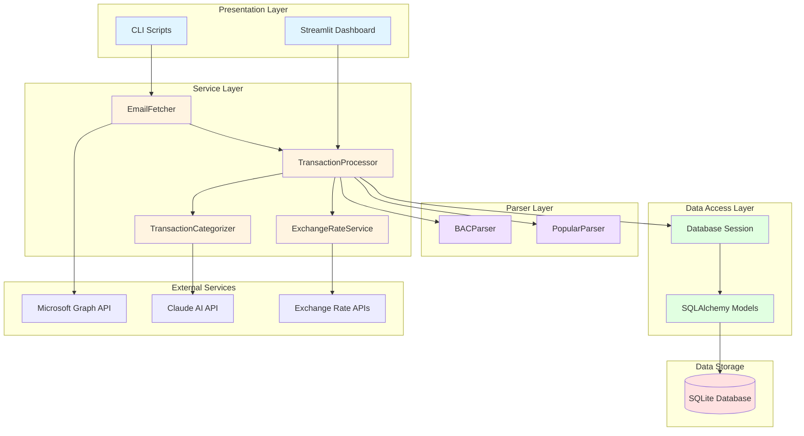
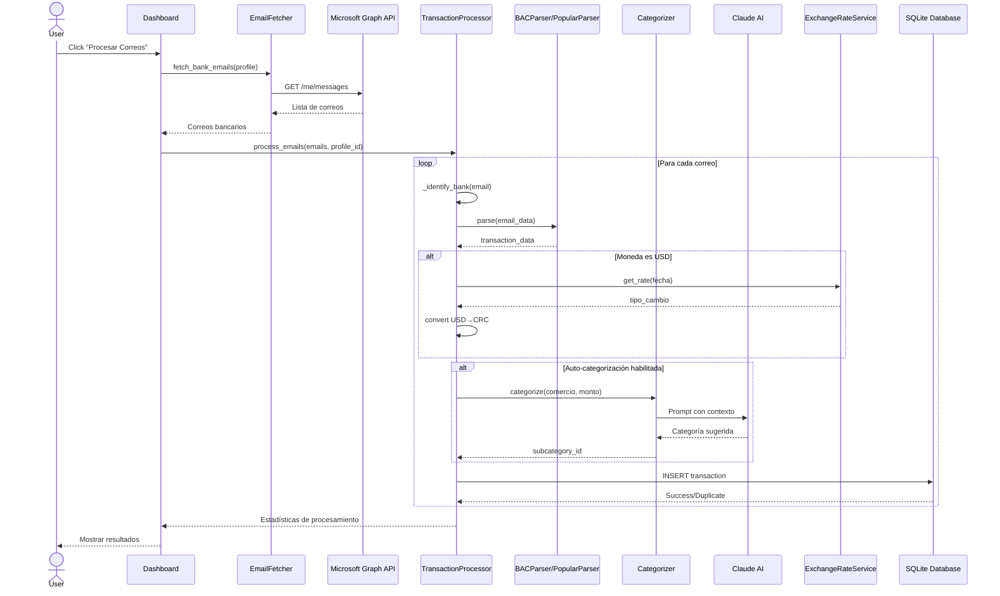
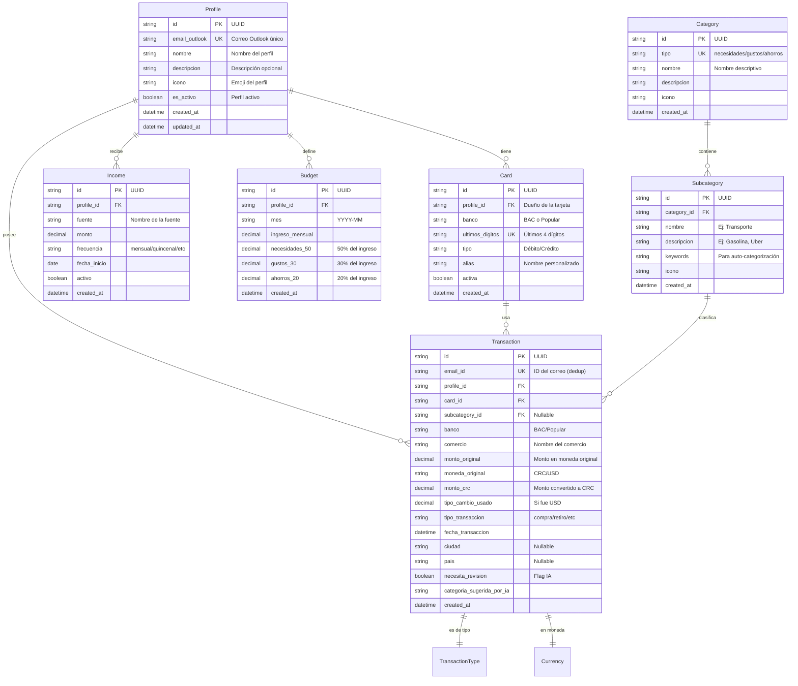

# Arquitectura del Sistema - Finanzas Email Tracker

## 📋 Tabla de Contenidos

- [Visión General](#visión-general)
- [Arquitectura de Capas](#arquitectura-de-capas)
- [Flujo de Datos](#flujo-de-datos)
- [Modelo de Datos](#modelo-de-datos)
- [Componentes Principales](#componentes-principales)
- [Decisiones Arquitectónicas](#decisiones-arquitectónicas)
- [Patrones de Diseño](#patrones-de-diseño)

---

## 🎯 Visión General

Sistema automatizado de rastreo financiero que procesa correos electrónicos bancarios, extrae transacciones, categoriza con IA, y presenta análisis financieros en un dashboard interactivo.

### Características Clave
- ✅ Extracción automática de transacciones desde correos Outlook
- ✅ Parseo robusto de HTML de múltiples bancos (BAC, Banco Popular)
- ✅ Categorización inteligente con Claude AI (Anthropic)
- ✅ Conversión automática USD → CRC con tipos de cambio históricos
- ✅ Sistema multi-perfil (personal, negocio, familia)
- ✅ Dashboard interactivo con Streamlit

---

## 🏗️ Arquitectura de Capas

El sistema sigue una **arquitectura en capas** (layered architecture) con separación clara de responsabilidades:



### Descripción de Capas

#### 1. **Presentation Layer** (Capa de Presentación)
- **Responsabilidad**: Interfaz de usuario y comandos CLI
- **Componentes**: Streamlit Dashboard, CLI scripts
- **Tecnologías**: Streamlit, Python argparse

#### 2. **Service Layer** (Capa de Servicios)
- **Responsabilidad**: Lógica de negocio y orquestación
- **Componentes**:
  - `EmailFetcher`: Obtiene correos de Outlook via Microsoft Graph
  - `TransactionProcessor`: Orquesta todo el flujo de procesamiento
  - `TransactionCategorizer`: Categoriza con IA usando Claude
  - `ExchangeRateService`: Obtiene tipos de cambio históricos
- **Patrones**: Service Layer, Facade

#### 3. **Parser Layer** (Capa de Parseo)
- **Responsabilidad**: Extracción de datos de correos HTML
- **Componentes**: BACParser, PopularParser
- **Patrones**: Strategy Pattern (diferentes parsers por banco)

#### 4. **Data Access Layer** (Capa de Acceso a Datos)
- **Responsabilidad**: Persistencia y queries a base de datos
- **Componentes**: SQLAlchemy ORM Models
- **Patrones**: Active Record, Unit of Work

---

## 🔄 Flujo de Datos End-to-End



### Flujo Detallado

1. **Obtención de Correos**
   - Usuario inicia proceso desde Dashboard
   - `EmailFetcher` consulta Microsoft Graph API
   - Filtra correos por sender (bancos conocidos)
   - Retorna lista de correos bancarios

2. **Procesamiento**
   - `TransactionProcessor` identifica banco por sender
   - Selecciona parser apropiado (Strategy Pattern)
   - Parser extrae datos del HTML con BeautifulSoup + Regex
   - Valida y normaliza datos (Decimal para montos)

3. **Conversión de Moneda** (si aplica)
   - Detecta transacciones en USD
   - Consulta tipo de cambio histórico para la fecha
   - Convierte a CRC con precisión Decimal

4. **Categorización IA** (opcional)
   - Busca en historial de transacciones similares
   - Si no hay match, consulta Claude AI
   - Claude retorna categoría con nivel de confianza
   - Marca para revisión si confianza < 80%

5. **Persistencia**
   - Crea objeto Transaction con SQLAlchemy
   - Guarda en base de datos
   - Maneja duplicados (constraint en email_id)

6. **Resultados**
   - Retorna estadísticas: procesados, duplicados, errores
   - Dashboard actualiza visualizaciones

---

## 📊 Modelo de Datos (Entity-Relationship Diagram)



### Descripción de Entidades Principales

#### **Profile** (Entidad Central)
- Representa un contexto financiero separado
- Permite gestionar múltiples perfiles (personal, negocio, familia)
- Cada perfil tiene su propio email de Outlook
- Un perfil puede estar "activo" para el dashboard

#### **Transaction** (Entidad Core)
- Registro de cada transacción bancaria
- `email_id` único previene duplicados
- `necesita_revision`: flag para transacciones ambiguas
- Soporte para USD con tipo de cambio histórico

#### **Category & Subcategory** (Sistema 50/30/20)
- 3 categorías principales: Necesidades, Gustos, Ahorros
- Subcategorías granulares con keywords
- Keywords permiten auto-categorización sin IA

#### **Card**
- Tarjetas bancarias asociadas a un perfil
- Identificación por últimos 4 dígitos
- Soft delete (activa = false)

---

## 🧩 Componentes Principales

### 1. **EmailFetcher** (`services/email_fetcher.py`)

**Responsabilidad**: Obtención de correos bancarios desde Outlook

**Dependencias**:
- Microsoft Graph API (via `msgraph-sdk`)
- `AuthManager` para autenticación OAuth2

**Flujo**:
```python
1. Autenticación con Azure AD (OAuth2 PKCE)
2. Query a Microsoft Graph: /me/messages
3. Filtros:
   - Sender en lista de bancos conocidos
   - Fecha >= days_back
   - Carpeta: Inbox
4. Retorna lista de emails con: id, subject, body, sender, date
```

**Características**:
- ✅ Retry automático con exponential backoff
- ✅ Paginación (batches de 50)
- ✅ Filtrado por sender para performance
- ✅ Cache de tokens OAuth en keyring

---

### 2. **TransactionProcessor** (`services/transaction_processor.py`)

**Responsabilidad**: Orquestación del flujo completo de procesamiento

**Arquitectura**:
```python
class TransactionProcessor:
    """
    Facade Pattern: Simplifica interacción con múltiples subsistemas
    """

    def __init__(self, auto_categorize: bool = True):
        # Lazy loading de categorizer (solo si se necesita)
        self.categorizer = TransactionCategorizer() if auto_categorize else None

    def process_emails(self, emails, profile_id) -> dict:
        """
        Procesa batch de correos end-to-end

        Pipeline:
        1. Identificar banco -> 2. Parsear -> 3. Convertir USD
        4. Categorizar (IA) -> 5. Guardar -> 6. Stats
        """
```

**Patrones**:
- **Facade Pattern**: Simplifica orquestación compleja
- **Pipeline Pattern**: Procesamiento en etapas secuenciales
- **Strategy Pattern**: Selección dinámica de parser por banco

**Testing**: 93% coverage con mocks de DB y APIs

---

### 3. **BACParser & PopularParser** (`parsers/`)

**Responsabilidad**: Extracción estructurada de datos desde HTML bancario

**Desafío**: HTML no-estándar, inconsistente entre emails

**Solución**:
```python
class BACParser:
    """
    Parser robusto con múltiples estrategias de extracción:

    1. BeautifulSoup para estructura HTML
    2. Regex para patrones de texto
    3. Fallbacks para campos opcionales
    4. Validación con Decimal para precisión
    """

    @staticmethod
    def parse(email_data: dict) -> dict | None:
        """
        Estrategia de parsing en cascada:

        1. Intentar extraer de tabla HTML
        2. Si falla, buscar en párrafos <p>
        3. Si falla, usar regex en subject
        4. Validar campos requeridos
        5. Retornar None si no se puede parsear
        """
```

**Características**:
- ✅ Manejo robusto de edge cases (HTML malformado)
- ✅ Extracción de fechas con múltiples formatos
- ✅ Normalización de montos (eliminación de comas, conversión a Decimal)
- ✅ Fallback a email subject si HTML no tiene datos

**Testing**: 87-89% coverage con 51 tests

---

### 4. **TransactionCategorizer** (`services/categorizer.py`)

**Responsabilidad**: Categorización inteligente con IA

**Estrategia en 3 niveles**:

```python
1. Keywords Match (Instant):
   - "Gasolina" → Necesidades/Transporte
   - "Netflix" → Gustos/Entretenimiento

2. Historical Learning (Fast):
   - "STARBUCKS" ya categorizado antes → usar mismo
   - Incrementa confianza con cada uso

3. Claude AI (Fallback):
   - Comercios ambiguos (ej: "WALMART")
   - Prompt con contexto del negocio
   - Retorna categoría + confianza (0-100)
```

**Prompt Engineering**:
```python
system_prompt = """
Eres un experto en finanzas personales...
Categoriza según metodología 50/30/20:
- Necesidades: Esenciales para vivir
- Gustos: Discrecionales, pueden eliminarse
- Ahorros: Inversiones, ahorro
"""

user_prompt = f"""
Comercio: {comercio}
Monto: {monto} CRC
Historial: {transacciones_similares}

Retorna JSON: {{"categoria": "...", "confianza": 85}}
"""
```

**Optimización de Costos**:
- Modelo: Claude Haiku 4.5 ($1/M tokens - 5x más barato que Sonnet)
- Temperature: 0.3 (determinístico)
- Max tokens: 1024 (suficiente para JSON corto)
- Cache: Historial de transacciones similar

---

### 5. **ExchangeRateService** (`services/exchange_rate.py`)

**Responsabilidad**: Conversión precisa USD → CRC con tipos históricos

**Fuentes de Datos (Fallback Chain)**:
```python
1. Cache local (dict en memoria)
2. API Ministerio de Hacienda CR (oficial, gratuita)
3. ExchangeRate.host API (backup, gratuita)
4. settings.usd_to_crc_rate (fallback final)
```

**Precisión**:
- Tipo de cambio histórico (no usar rate actual para transacciones pasadas)
- Uso de `Decimal` para evitar errores de punto flotante
- Cache para evitar requests repetidos

**Ejemplo**:
```python
service = ExchangeRateService()

# Obtener tipo de cambio para fecha específica
rate = service.get_rate("2025-11-06")  # ₡520.50

# Convertir monto
crc = service.convert_usd_to_crc(50.00, "2025-11-06")
# ₡26,025.00
```

---

## 🎨 Decisiones Arquitectónicas (ADRs)

### ADR-001: SQLite como Base de Datos

**Contexto**: Aplicación personal/familiar, no web pública

**Decisión**: Usar SQLite en lugar de PostgreSQL/MySQL

**Razones**:
- ✅ Zero configuration (no servidor DB)
- ✅ File-based (fácil backup con git)
- ✅ Suficiente para <100K transacciones
- ✅ ACID compliant
- ✅ Excelente para desarrollo local

**Consecuencias**:
- ➕ Setup simple, portabilidad
- ➖ No adecuado para múltiples usuarios concurrentes
- ➖ Migraciones más manuales que con PostgreSQL

**Alternativa futura**: Si escala a web app → migrar a PostgreSQL

---

### ADR-002: Pydantic para Validación de Configuración

**Contexto**: Muchas variables de entorno, configuración compleja

**Decisión**: Usar `pydantic-settings` en lugar de `python-decouple`

**Razones**:
- ✅ Type safety automático
- ✅ Validación declarativa
- ✅ Error messages claros
- ✅ Integración con IDE (autocomplete)
- ✅ Soporta validadores custom

**Ejemplo**:
```python
class Settings(BaseSettings):
    email_fetch_days_back: int = Field(ge=1, le=365)  # Auto-validación
    anthropic_api_key: str = Field(min_length=20)    # No vacío
```

---

### ADR-003: Claude Haiku 4.5 para Categorización

**Contexto**: Necesidad de categorización inteligente, presupuesto limitado

**Decisión**: Claude Haiku 4.5 en lugar de GPT-4 o Claude Sonnet

**Razones**:
- ✅ Costo: $1/M tokens (vs $15/M de GPT-4)
- ✅ Velocidad: <3s response (vs >10s de modelos grandes)
- ✅ Calidad: Suficiente para clasificación simple
- ✅ Soporte JSON nativo
- ✅ Provider: Anthropic (mejor para structured output)

**Optimizaciones**:
- Temperature: 0.3 (más determinístico)
- System prompts optimizados
- Fallback a keywords (evita costo IA)

**Costo mensual estimado**: ~$0.50 para 50 transacciones/día

---

### ADR-004: Multi-Perfil Sin Modelo User

**Contexto**: App familiar simple, no necesita autenticación

**Decisión**: Profile como entidad principal, sin User model

**Razones**:
- ✅ Simplifica arquitectura (no auth, no sessions)
- ✅ Cada perfil = email de Outlook separado
- ✅ Dashboard selecciona perfil activo
- ✅ Evita over-engineering

**Trade-offs**:
- ➕ Código más simple
- ➖ No adecuado para web multi-tenant
- ➖ No hay permisos por usuario

**Alternativa futura**: Agregar User + roles si se hace web app

---

### ADR-005: Streamlit para Dashboard

**Contexto**: Necesidad de UI interactiva, desarrollo rápido

**Decisión**: Streamlit en lugar de Flask/FastAPI + React

**Razones**:
- ✅ Prototipado ultra-rápido (100 líneas = dashboard completo)
- ✅ Reactive por defecto (state management simple)
- ✅ Componentes out-of-the-box (charts, tables, forms)
- ✅ Zero configuración frontend
- ✅ Ideal para data apps

**Trade-offs**:
- ➕ Desarrollo 10x más rápido
- ➖ No ideal para apps web complejas
- ➖ Menos control de UX que React
- ➖ Re-run completo en cada interacción

**Justificación**: Para MVP/personal use, Streamlit es perfecto

---

## 🔧 Patrones de Diseño Utilizados

### 1. **Strategy Pattern** (Parsers)

```python
# Selección dinámica de parser según banco
def _get_parser(self, banco: str):
    parsers = {
        "bac": BACParser,
        "popular": PopularParser,
    }
    return parsers.get(banco)

# Uso
parser_class = self._get_parser(banco)
data = parser_class.parse(email)
```

**Beneficio**: Fácil agregar nuevos bancos sin modificar processor

---

### 2. **Facade Pattern** (TransactionProcessor)

```python
# Cliente solo ve una interfaz simple:
processor = TransactionProcessor()
stats = processor.process_emails(emails, profile_id)

# Internamente orquesta múltiples subsistemas:
# - Parser selection
# - Currency conversion
# - AI categorization
# - Database persistence
```

**Beneficio**: Simplifica complejidad para el cliente

---

### 3. **Active Record** (SQLAlchemy Models)

```python
# Modelo incluye lógica de persistencia
transaction = Transaction(
    comercio="STARBUCKS",
    monto_crc=Decimal("5000.00"),
    ...
)

session.add(transaction)
session.commit()  # Persiste automáticamente
```

**Beneficio**: ORM simplifica acceso a datos

---

### 4. **Singleton** (Settings, Services)

```python
@lru_cache
def get_settings() -> Settings:
    return Settings()  # Solo se crea una vez

settings = get_settings()  # Singleton global
```

**Beneficio**: Una sola instancia de configuración en toda la app

---

### 5. **Template Method** (Parser base - implícito)

```python
# Ambos parsers siguen misma estructura:
class BaseParser:
    def parse(email_data):
        comercio = self._extract_comercio(email_data)
        monto = self._extract_monto(email_data)
        fecha = self._extract_fecha(email_data)
        return self._build_result(...)
```

**Beneficio**: Estructura consistente, reutilización de código

---

## 🚀 Escalabilidad y Rendimiento

### Optimizaciones Actuales

1. **Índices de Base de Datos**
   ```sql
   CREATE INDEX ix_transactions_profile_date
   ON transactions(profile_id, fecha_transaccion);

   CREATE UNIQUE INDEX ix_transactions_email_id
   ON transactions(email_id);  -- Previene duplicados
   ```

2. **Cache de Tipos de Cambio**
   ```python
   # Cache en memoria para evitar API calls repetidos
   _cache: dict[str, float] = {}
   ```

3. **Batch Processing**
   ```python
   # Procesa correos en lotes de 50
   EMAIL_BATCH_SIZE = 50
   ```

### Mejoras Futuras (Si Escala)

1. **Background Tasks**
   - Procesamiento asíncrono con Celery/RQ
   - Cola de tareas para procesamiento largo

2. **Caching Distribuido**
   - Redis para cache compartido
   - Cache de categorización IA

3. **Database Migration**
   - PostgreSQL para mejor concurrencia
   - Read replicas para analytics

4. **API Layer**
   - FastAPI REST API
   - Separación frontend/backend

---

## 📚 Referencias

- [Microsoft Graph API Docs](https://learn.microsoft.com/en-us/graph/)
- [Anthropic Claude API](https://docs.anthropic.com/)
- [SQLAlchemy 2.0 Docs](https://docs.sqlalchemy.org/)
- [Streamlit Documentation](https://docs.streamlit.io/)

---

## 🔄 Changelog de Arquitectura

### v0.1.0 (2025-11-19)
- ✅ Arquitectura inicial en capas
- ✅ Implementación de parsers (BAC, Popular)
- ✅ Integración con Claude AI
- ✅ Sistema multi-perfil
- ✅ Dashboard Streamlit básico

### Próximas Mejoras Planeadas
- [ ] API REST con FastAPI
- [ ] Sistema de notificaciones (email/SMS)
- [ ] Exportación de reportes (PDF, Excel)
- [ ] Machine Learning para predicción de gastos
- [ ] Detección de anomalías
