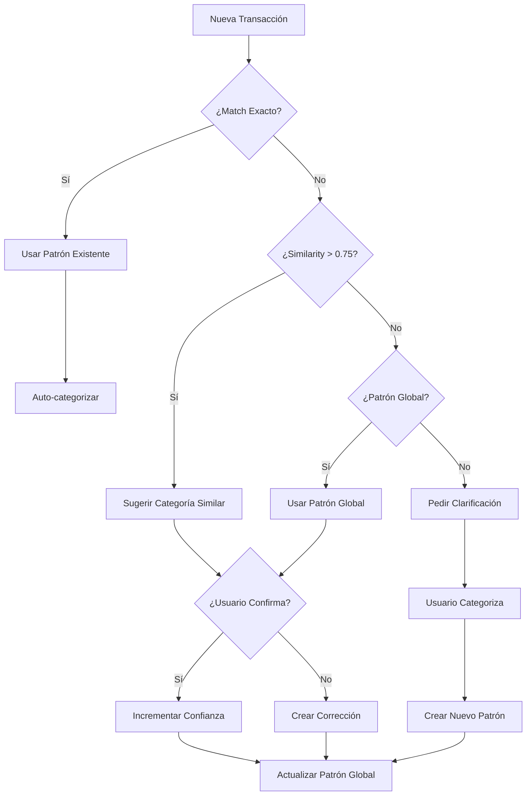

# 🧠 Sistema de Aprendizaje Inteligente - Finanzas Tracker CR

## Resumen

El Sistema de Aprendizaje Inteligente es el **core de inteligencia** del Finanzas Tracker. 
Usa embeddings vectoriales y pgvector para aprender automáticamente de las transacciones 
del usuario y mejorar las categorizaciones futuras.

## Arquitectura

```
┌─────────────────────────────────────────────────────────────────┐
│                    4 CAPAS DE APRENDIZAJE                       │
├─────────────────────────────────────────────────────────────────┤
│  1. USUARIO: Patrones personales del usuario                   │
│     - "JUAN PEREZ" → "Préstamo a Papá"                          │
│     - Alta confianza, máxima prioridad                          │
├─────────────────────────────────────────────────────────────────┤
│  2. PERFIL: Cluster de usuarios similares                       │
│     - Usuarios con patrones de gasto similares                  │
│     - Mejora sugerencias para usuarios nuevos                   │
├─────────────────────────────────────────────────────────────────┤
│  3. PAÍS: Patrones crowdsourced de Costa Rica                   │
│     - 100+ usuarios categorizan "AUTOMERCADO" → Supermercado   │
│     - Auto-aprobación con 5+ usuarios, 90%+ coincidencia       │
├─────────────────────────────────────────────────────────────────┤
│  4. BASE: Conocimiento base (Automercado, Uber, etc.)           │
│     - Comercios conocidos pre-configurados                      │
│     - Fallback cuando no hay datos del usuario                  │
└─────────────────────────────────────────────────────────────────┘
```

## Componentes

### 1. Modelos de Datos (`models/smart_learning.py`)

| Modelo | Descripción |
|--------|-------------|
| `TransactionPattern` | Patrón aprendido con embedding vectorial |
| `UserLearningProfile` | Perfil de aprendizaje del usuario |
| `GlobalPattern` | Patrones crowdsourced de todos los usuarios |
| `PatternCluster` | Clusters de patrones similares |
| `LearningEvent` | Log de eventos de aprendizaje |

### 2. Servicio Principal (`services/smart_learning_service.py`)

```python
from finanzas_tracker.services import SmartLearningService

service = SmartLearningService(db)

# Aprender de una categorización
result = service.learn_from_categorization(
    profile_id="user-123",
    text="JUAN PEREZ",
    subcategory_id="subcat-456",
    user_label="Papá"
)

# Obtener sugerencias inteligentes
suggestions = service.get_smart_suggestions(
    profile_id="user-123",
    text="SINPE a Juan Pérez Mora"
)

# Auto-categorizar si hay alta confianza
auto_result = service.auto_categorize(
    profile_id="user-123",
    text="AUTOMERCADO ESCAZU"
)
```

### 3. Embeddings (`services/local_embedding_service.py`)

- **Modelo**: `all-MiniLM-L6-v2` (100% gratis, local)
- **Dimensiones**: 384 (paddeado a 1536 para compatibilidad OpenAI)
- **Velocidad**: ~14,000 textos/segundo en CPU
- **Idiomas**: Multilingüe (incluye español)

### 4. Pipeline de Entrenamiento (`scripts/train_learning_system.py`)

```bash
# Entrenar desde todas las transacciones históricas
python scripts/train_learning_system.py

# Entrenar solo un perfil específico
python scripts/train_learning_system.py --profile-id "123-abc"

# Regenerar embeddings (después de cambiar modelo)
python scripts/train_learning_system.py --regenerate-embeddings

# Dry run (sin guardar cambios)
python scripts/train_learning_system.py --dry-run
```

### 5. Dashboard (`dashboard/pages/12_learning.py`)

Visualización del sistema de ML:
- Métricas de precisión
- Patrones aprendidos
- Estadísticas de confirmaciones/correcciones
- Patrones globales de Costa Rica
- Historial de eventos

## Flujo de Aprendizaje



## Base de Datos

### Tablas Nuevas (Migración `a1b2c3d4e5f6`)

```sql
-- Patrones con embeddings
CREATE TABLE transaction_patterns (
    id UUID PRIMARY KEY,
    profile_id VARCHAR(36),
    pattern_text VARCHAR(500),
    pattern_text_normalized VARCHAR(500),
    pattern_type pattern_type_enum,
    embedding VECTOR(1536),  -- pgvector
    subcategory_id VARCHAR(36),
    confidence NUMERIC(5,4),
    times_matched INTEGER,
    is_recurring BOOLEAN,
    ...
);

-- Índice HNSW para similarity search
CREATE INDEX ON transaction_patterns 
USING hnsw (embedding vector_cosine_ops);

-- Patrones globales crowdsourced
CREATE TABLE global_patterns (
    id UUID PRIMARY KEY,
    pattern_text_normalized VARCHAR(500) UNIQUE,
    primary_subcategory_id VARCHAR(36),
    user_count INTEGER,
    vote_distribution JSONB,
    is_approved BOOLEAN,
    is_auto_approved BOOLEAN,
    ...
);
```

## Configuración

### Umbrales Configurables

```python
class SmartLearningService:
    AUTO_APPROVE_THRESHOLD = 0.90   # Confianza para auto-aprobar
    SIMILARITY_THRESHOLD = 0.75    # Similitud mínima para match
    MIN_USERS_FOR_GLOBAL = 5       # Usuarios para patrón global
```

### Variables de Entorno

```bash
# Opcional: usar Voyage AI en lugar de modelo local
VOYAGE_API_KEY=your-key-here

# Opcional: usar OpenAI embeddings
OPENAI_API_KEY=your-key-here
```

## Métricas de Éxito

| Métrica | Objetivo | Descripción |
|---------|----------|-------------|
| Precisión | >85% | % de sugerencias correctas |
| Auto-categorización | >70% | % de transacciones auto-categorizadas |
| Correcciones | <15% | % de correcciones necesarias |
| Cobertura Embeddings | 100% | % de patrones con embedding |

## Próximos Pasos

1. **Clustering K-means**: Agrupar transacciones similares automáticamente
2. **Detección de Anomalías**: Alertar gastos inusuales
3. **Predicción de Categoría**: Modelo de ML supervisado
4. **A/B Testing**: Comparar diferentes modelos de embeddings
5. **Multitenancy**: Separación de datos por tenant

## Archivos Creados

```
src/finanzas_tracker/
├── models/
│   └── smart_learning.py          # Modelos de ML
├── services/
│   ├── smart_learning_service.py  # Servicio principal
│   └── local_embedding_service.py # Embeddings locales
├── dashboard/
│   └── pages/
│       └── 12_learning.py         # Dashboard ML

alembic/versions/
└── a1b2c3d4e5f6_add_smart_learning_ml_tables.py

scripts/
└── train_learning_system.py       # Pipeline de entrenamiento
```

## Referencias

- [pgvector Documentation](https://github.com/pgvector/pgvector)
- [Sentence Transformers](https://www.sbert.net/)
- [OpenAI Embeddings](https://platform.openai.com/docs/guides/embeddings)
- [Voyage AI](https://www.voyageai.com/)
